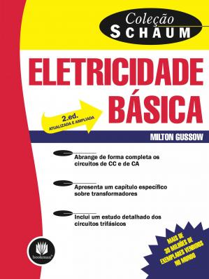

# Sistemas Embarcados

Prof. Eduardo Ono

 

## Descrição

 
<small>Fonte: https://pplware.sapo.pt/high-tech/iron-dome-de-israel-bloqueia-80-dos-foguetes/</small>

 

## Conteúdo Programático (80h)

| Aula | Data  | Conteúdo |
| :-: |  :-:  | ---
| [01] | 18/10 | Overview - Conceitos e Aplicações de Sistemas Embarcados; Fundamentos de Eletrecidade e Eletrônica Básica
| [02] | 25/10 | Microcontroladores; Introdução ao Arduino - Placas, IDE e API; Ambiente de Desenvolvimento
| [03] | 08/11 | Programação em Arduino - Análise de desempenho de E/S
| [04] | 22/11 | Conversor Analógico-Digital (ADC) e Conversor Digital-Analógico (DAC)
| [05] | 29/11 | Pulse Width Modulation (PWM)
| [06] | 06/12 | Sensores e Atuadores - Conceitos e Aplicações
| [07] |       | Programação em Arduino - Exemplos de uso de Sensores e Atuadores
| -- |       | __Avaliação__
| [08] |       | Entrada digital - Botões (_push buttons_); Resistores Pull-Up e Pull-Down
| [09] |       | Interrupções e Temporizadores (_Timers_)
| [10] |       | Multitarefa; Programação Concorrente com FreeRTOS
| 11 |       | Protocolos de Comunicação
| 12 |       | Raspberry Pi
| 13 |       | "Devolutiva" da 2a. Avaliação
| -- |       | Avaliação de 2a. Chamada

[01]: ./aulas/README.md#aula-01
[02]: ./aulas/README.md#aula-02
[03]: ./aulas/README.md#aula-03
[04]: ./aulas/README.md#aula-04
[05]: ./aulas/README.md#aula-05
[06]: ./aulas/README.md#aula-06
[07]: ./aulas/README.md#aula-07
[08]: ./aulas/README.md#aula-08
[09]: ./aulas/README.md#aula-09
[10]: ./aulas/README.md#aula-10
[11]: ./aulas/README.md#aula-11
[12]: ./aulas/README.md#aula-12
[13]: ./aulas/README.md#aula-13

 

## Recursos

* [Arduino IDE](https://www.arduino.cc)
* [TinkerCAD](https://www.tinkercad.com)
* [SimulIDE](https://www.simulide.com)
* Placa Arduino Uno (opcional)
* Placa Raspberry Pi 3B, 3B+ ou 4

 

## Bibliografia Básica

| Capa | Descrição |
| :-:  | --- |
|  | [MONK-2e_2019] MONK, Simon; __Programming Arduino Next Steps: Going Further with Sketches, 2. ed.__, McGraw-Hill Education, 2019[.](https://app.box.com/s/onxakui60rfqif5jh7800uod4q9xtebm)
|  | [RUSSELL_2010] RUSSELL, David; __Introduction to Embedded Systems - Using ANSI C and the Arduino Development Environment__, Morgan & Claypool, 2010[.](https://app.box.com/s/dglipxr1taeq5ofsowbnwik0owo0s47x)
|  | [McROBERTS_2011] McROBERTS, Michael; __Arduino Básico__, São Paulo: Novatec Editora, 2011[.](https://app.box.com/s/gr402oiw0ivv55lvdclk7wnsj1pga7rx)
|  | [GUSSOW-2e_2009] GUSSOW, Milton; __Eletricidade Básica, 2. ed.__, Porto Alegre: Bookman, 2009[.](https://app.box.com/s/c7dhfb3t0sopygntto0tlbvbwz92u9tj)

 

## Bibliografia Complementar

| Capa | Descrição |
| :-:  | --- |
|  | [PLATT-2e_2015] PLATT, Charles; __Make - Electronics, 2. ed.__, Make Community, LLC, 2015[.](https://app.box.com/s/r2p1z56spe3bybzy593mh8zladezyslz)
|  | [TOCCI-11e_2011] TOCCI, Ronald J.; WIDNER, Neal S.; MOSS, Gregory L.; __Sistemas Digitais - Princípios e Aplicações, 11. ed.__, Pearson Universidades, 2011[.](https://app.box.com/s/98g9e4939fd27vxqpvcyrbcg0iykhnwu)
|  | [IDOETA-40e_2008] IDOETA, Ivan, V.; CAPUANO, Francisco G.; __Elementos de Eletrônica Digital, 40. ed.__, São Paulo: Editora Érica Ltda., 2008[.](https://app.box.com/s/a5jgfgbhj1s77tc0qwup)
|  | [MONK-2e_2017] MONK, Simon; __Hacking Electronics - Learning Electronics with Arduino and Raspberry Pi, 2. ed.__,  McGraw-Hill Education, 2017.
|  | [MONK_2013] MONK, Simon.; __Programming Arduino Next Steps: Going Further with Sketches (epub)__, 2013[.](https://app.box.com/s/mbmb2h06we9zxkzl0ecko4yxpn2tvbgo)
|  | [SILVA_2015] SILVA, Clarence W. de; __Sensors and Actuators: Engineering System Instrumentation, 2. ed.__, CRC Press, 2015[.](https://app.box.com/s/01ekh5g479pcg3xmbyj3ctiurxiv7t5o)

 

## Vídeos Recomendados

| Thumb | Descrição |
| :-: | --- |
|  | [Pianistos] [__[HQ] Someone like you - Adele (Piano cover)__](https://www.youtube.com/watch?v=81q9kBRQt1E)   (YouTube, 5:02, Dez/2015)
|  | [Pianistos] [__3D Spectrum Analyser (1280 LEDs) - MAKING OF__](https://www.youtube.com/watch?v=Vn39txtVIHc)   (YouTube, 22:56, Jan/2015)
|  | [ElectroSmash] [__pedalSHIELD DUE Arduino Guitar Pedal__](https://www.youtube.com/watch?v=COPaqJBekBQ)   (YouTube, 2:20, Dez/2013)
|  | [PRO ROBOTS] [__The newest robots 2021 \| Incredible and technologically advanced robots__](https://www.youtube.com/watch?v=m-LP4qpOLl0)   (YouTube, 10:08, Mai/2021)

 

## Filmes e Documentários Recomendados

| Thumb | Descrição |
| :-: | --- |
|  | [__EVA (2011)__](https://www.youtube.com/watch?v=GaBX2sY6V2E)   (Trailer, YouTube, Fev/2015)

 
