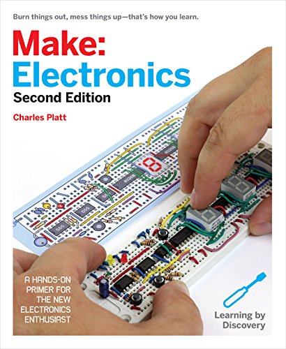
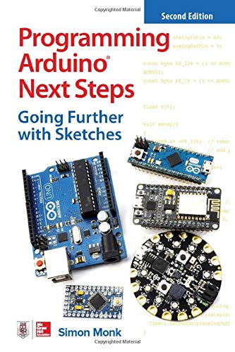
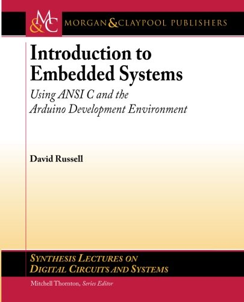
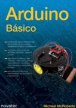
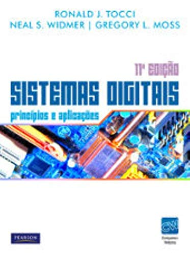
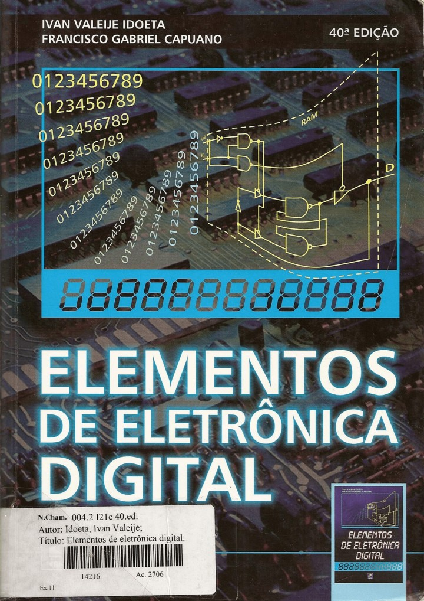
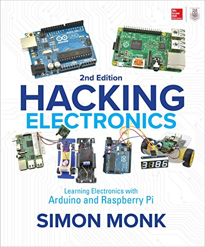
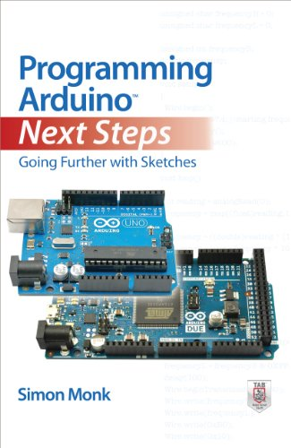
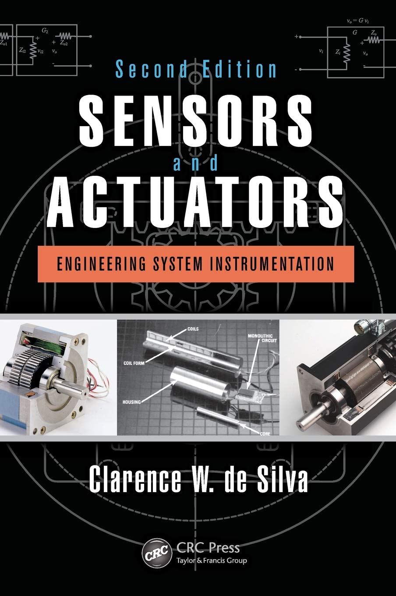

# Sistemas Embarcados

Prof. Eduardo Ono

 

## Descrição

 

## Conteúdo Programático (40h)

| Aula | Data  | Conteúdo |
| :-: |  :-:  | ---
| 01 | 24/02 | Overview - Conceitos e Aplicações de Sistemas Embarcados
| 02 | 03/03 | Introdução ao Arduino - Placas, IDE e API
| 03 | 10/03 | Programação em Arduino - Análise de desempenho de E/S
| 04 | 17/03 | Conversor Analógico-Digital (ADC) e Conversor Digital-Analógico (DAC)
| 05 | 24/03 | Pulse Width Modulation (PWM)
| 06 | 31/03 | Sensores e Atuadores - Conceitos e Aplicações
| 07 | 07/04 | Programação em Arduino - Exemplos de uso de Sensores e Atuadores
| -- | 14/04 | 1a. Avaliação
| -- | 21/04 | (Feriado)
| 08 | 28/04 | Botões (push buttons); Resistores Pull-Up e Pull-Down
| 09 | 05/05 | Timers e Interrupções
| 10 | 12/05 | Multitasking; Programação Concorrente com FreeRTOS
| 11 | 19/05 | Simulador SimulIDE
| 12 | 26/05 | Protocolos de Comunicação
| 13 | 02/06 | Raspberry Pi
| -- | 09/06 | 2a. Avaliação (a ser confirmado)

 

## Recursos

* [Arduino IDE](https://www.arduino.cc)
* https://www.tinkercad.com
* [SimulIDE](https://www.simulide.com)
* Placa Arduino Uno (opcional)

 

## Bibliografia Básica

| Capa | Descrição |
| :-:  | --- |
|  | [PLATT-2e_2015] PLATT, Charles; **Make - Electronics, 2. ed.**, Make Community, LLC, 2015[.](https://app.box.com/s/r2p1z56spe3bybzy593mh8zladezyslz)
|  | [MONK-2e_2019] MONK, Simon; **Programming Arduino Next Steps: Going Further with Sketches, 2. ed.**, McGraw-Hill Education, 2019[.](https://app.box.com/s/onxakui60rfqif5jh7800uod4q9xtebm)
|  | [RUSSELL_2010] RUSSELL, David; **Introduction to Embedded Systems - Using ANSI C and the Arduino Development Environment**, Morgan & Claypool, 2010[.](https://app.box.com/s/dglipxr1taeq5ofsowbnwik0owo0s47x)
|  | [McROBERTS_2011] McROBERTS, Michael; **Arduino Básico**, São Paulo: Novatec Editora, 2011[.](https://app.box.com/s/gr402oiw0ivv55lvdclk7wnsj1pga7rx)

 

## Bibliografia Complementar

| Capa | Descrição |
| :-:  | --- |
|  | [TOCCI-11e_2011] TOCCI, Ronald J.; WIDNER, Neal S.; MOSS, Gregory L.; **Sistemas Digitais - Princípios e Aplicações, 11. ed.**, Pearson Universidades, 2011[.](https://app.box.com/s/98g9e4939fd27vxqpvcyrbcg0iykhnwu)
|  | [IDOETA-40e_2008] IDOETA, Ivan, V.; CAPUANO, Francisco G.; **Elementos de Eletrônica Digital, 40. ed.**, São Paulo: Editora Érica Ltda., 2008[.](https://app.box.com/s/a5jgfgbhj1s77tc0qwup)
|  | [MONK-2e_2017] MONK, Simon; **Hacking Electronics - Learning Electronics with Arduino and Raspberry Pi, 2. ed.**,  McGraw-Hill Education, 2017.
|  | [MONK_2013] MONK, Simon.; **Programming Arduino Next Steps: Going Further with Sketches (epub)**, 2013[.](https://app.box.com/s/mbmb2h06we9zxkzl0ecko4yxpn2tvbgo)
|  | [SILVA_2015] SILVA, Clarence W. de; **Sensors and Actuators: Engineering System Instrumentation, 2. ed.**, CRC Press, 2015[.](https://app.box.com/s/01ekh5g479pcg3xmbyj3ctiurxiv7t5o)

 

## Vídeos Recomendados

| Thumb | Descrição |
| :-: | --- |
|  | [Pianistos] [**[HQ] Someone like you - Adele (Piano cover)**](https://www.youtube.com/watch?v=81q9kBRQt1E) (YouTube, 5:02, Dez/2015)
|  | [Pianistos] [**3D Spectrum Analyser (1280 LEDs) - MAKING OF**](https://www.youtube.com/watch?v=Vn39txtVIHc) (YouTube, 22:56, Jan/2015)
|  | [ElectroSmash] [**pedalSHIELD DUE Arduino Guitar Pedal**](https://www.youtube.com/watch?v=COPaqJBekBQ) (YouTube, 2:20, Dez/2013)
|  | [PRO ROBOTS] [__The newest robots 2021 \| Incredible and technologically advanced robots__](https://www.youtube.com/watch?v=m-LP4qpOLl0) (YouTube, 10:08, Mai/2021)

 

## Filmes e Documentários Recomendados

| Thumb | Descrição |
| :-: | --- |
|  | [**EVA (2011/2015)**](https://www.youtube.com/watch?v=2ctMc4DFpik) (YouTube, 2:16, Fev/2015)

 
