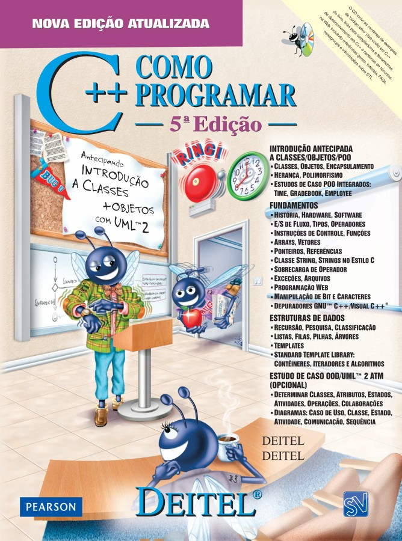

<h1 align="center">Sistemas Embarcados</h1>

<h4 align="center">Prof. Eduardo Ono</h4>

&nbsp;

## Descrição

 

<small>Fonte: https://pplware.sapo.pt/high-tech/iron-dome-de-israel-bloqueia-80-dos-foguetes/</small>

&nbsp;

## Conteúdo Programático (80h)

| Aula | Data  | Conteúdo |
| :-: |  :-:  | ---
| 01 | 10/10 | Overview - Conceitos e Aplicações de Sistemas Embarcados; Fundamentos de [Eletricidade] e [Eletrônica Básica].
| 02 | 17/10 | Microcontroladores; Introdução ao Arduino: Família de placas, IDE e API; Resolução digital; Conversor Analógico-Digital (ADC).
| 03 | 24/10 | Conversor Digital-Analógico (DAC); PWM ("Pulse Width Modulation"); [Introdução à API do Arduino]; Programação: [Operadores bit-a-bit].
| 04 | 07/11 | Primeiro _sketch_ do Arduino: [Pisca LED]; Estrutura de um _sketch_ do Arduino; Arquitetura ATmega328P, Uso dos registradores DDR e PORT.
| 05 | 21/11 | Alocação Dinâmica de Memória; Introdução à Programação Orientada em C++: Classes e Objetos; STL string (std::string).
| 06 | 28/11 | Display LCD; Arduino API: LiquidCrystal.
| 07 | 05/12 | ADC: Método das Aproximações Sucessivas; __2ª Avaliação__.  
| 08 |  | Introdução aos Sensores e Atuadores.
| 09 |  | Entrada digital: Botões (_push buttons_); Resistores Pull-Up e Pull-Down.
| 10 |  | Interrupções e Temporizadores (_Timers_).
| 11 |  | Multitarefa; Programação Concorrente com FreeRTOS.
| 12 |  | Protocolos de Comunicação.
| 13 |  | ESP32.
| 14 |  | Single Board Computers (SBC); [Raspberry Pi].
| 15 |  | Fundamentos de Internet das Coisas (IoT).

[Eletricidade]: ./conteudo/02-fundamentos/eletricidade-basica/README.md
[Eletrônica Básica]: ./conteudo/02-fundamentos/eletronica-basica/README.md
[Introdução à API do Arduino]: ./conteudo/04-arduino/04-api-do-arduino/README.md
[Operadores bit-a-bit]: ./conteudo/cpp-poo/operadores-bit-a-bit/README.md
[Pisca LED]: ./conteudo/04-arduino/03-ola-mundo/
[Raspberry Pi]: ./conteudo/raspberry-pi/README.md

&nbsp;

## Recursos

* [Arduino IDE](https://www.arduino.cc/en/software/)
* [SimulIDE](https://www.simulide.com)
* [TinkerCAD](https://www.tinkercad.com)
* Placa Arduino Uno/MEGA (opcional)
* Placa ESP32 (opcional)
* Placa Raspberry Pi 3B, 3B+ ou 4 (opcional)

&nbsp;

## Canais do YouTube Recomendados

* https://www.youtube.com/c/canalwrkits

&nbsp;

## Bibliografia Básica

| Capa | Descrição |
| :-:  | --- |
|  | [MONK-2e_2019] MONK, Simon; __Programming Arduino Next Steps: Going Further with Sketches, 2. ed.__, McGraw-Hill Education, 2019[.](https://app.box.com/s/onxakui60rfqif5jh7800uod4q9xtebm)
|  | [RUSSELL_2010] RUSSELL, David; __Introduction to Embedded Systems - Using ANSI C and the Arduino Development Environment__, Morgan & Claypool, 2010[.](https://app.box.com/s/dglipxr1taeq5ofsowbnwik0owo0s47x)
|  | [McROBERTS_2011] McROBERTS, Michael; __Arduino Básico__, São Paulo: Novatec Editora, 2011[.](https://app.box.com/s/gr402oiw0ivv55lvdclk7wnsj1pga7rx)
|  | [DEITEL-5e_2006] DEITEL, Harvey M.; DEITEL, Paul J., __C++: como programar__, São Paulo: Pearson Prentice Hall, 2006[.](https://archive.org/details/c-mais-mais-como-programar-5a-3a-edicoes-deitel-by-harvey-deitel/) Resenha: https://www.youtube.com/watch?v=csqfwVZlq_k

&nbsp;

## Bibliografia Complementar

| Capa | Descrição |
| :-:  | --- |
|  | [GUSSOW-2e_2009] GUSSOW, Milton; __Eletricidade Básica, 2. ed.__, Porto Alegre: Bookman, 2009[.](https://app.box.com/s/c7dhfb3t0sopygntto0tlbvbwz92u9tj)
|  | [PLATT-2e_2015] PLATT, Charles; __Make - Electronics, 2. ed.__, Make Community, LLC, 2015[.](https://app.box.com/s/r2p1z56spe3bybzy593mh8zladezyslz)
|  | [TOCCI-11e_2011] TOCCI, Ronald J.; WIDNER, Neal S.; MOSS, Gregory L.; __Sistemas Digitais - Princípios e Aplicações, 11. ed.__, Pearson Universidades, 2011[.](https://app.box.com/s/98g9e4939fd27vxqpvcyrbcg0iykhnwu)
|  | [IDOETA-40e_2008] IDOETA, Ivan, V.; CAPUANO, Francisco G.; __Elementos de Eletrônica Digital, 40. ed.__, São Paulo: Editora Érica Ltda., 2008[.](https://app.box.com/s/a5jgfgbhj1s77tc0qwup)
|  | [MONK-2e_2017] MONK, Simon; __Hacking Electronics - Learning Electronics with Arduino and Raspberry Pi, 2. ed.__,  McGraw-Hill Education, 2017.
|  | [MONK_2013] MONK, Simon.; __Programming Arduino Next Steps: Going Further with Sketches (epub)__, 2013[.](https://app.box.com/s/mbmb2h06we9zxkzl0ecko4yxpn2tvbgo)
|  | [SILVA_2015] SILVA, Clarence W. de; __Sensors and Actuators: Engineering System Instrumentation, 2. ed.__, CRC Press, 2015[.](https://app.box.com/s/01ekh5g479pcg3xmbyj3ctiurxiv7t5o)

&nbsp;

## Vídeos Recomendados

| Thumb | Descrição |
| :-: | --- |
|  | [Pianistos] [__[HQ] Someone like you - Adele (Piano cover)__](https://www.youtube.com/watch?v=81q9kBRQt1E) (YouTube, 5:02, Dez/2015)
|  | [Pianistos] [__3D Spectrum Analyser (1280 LEDs) - MAKING OF__](https://www.youtube.com/watch?v=Vn39txtVIHc) (YouTube, 22:56, Jan/2015)
|  | [ElectroSmash] [__pedalSHIELD DUE Arduino Guitar Pedal__](https://www.youtube.com/watch?v=COPaqJBekBQ) (YouTube, 2:20, Dez/2013)
|  | [PRO ROBOTS] [__The newest robots 2021 \| Incredible and technologically advanced robots__](https://www.youtube.com/watch?v=m-LP4qpOLl0) (YouTube, 10:08, Mai/2021)

&nbsp;

## Filmes e Documentários Recomendados

| Thumb | Descrição |
| :-: | --- |
|  | [__EVA (2011)__](https://www.youtube.com/watch?v=GaBX2sY6V2E)   (Trailer, YouTube, Fev/2015)
|  | [Interesting Engineering] [__Protection At The Speed Of Light: Israel's Iron Beam In Action__](https://www.youtube.com/watch?v=TG2kUanmo5U) (8:18, YouTube, Jun/2022) | 
|  | [AiTelly] [__Kamikaze drone Iran Shahed 136 \| How it Works__](https://www.youtube.com/watch?v=-U0usQ-g9GM) (7:13, YouTube, Out/2022) | 

&nbsp;
