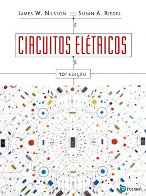

> <h5>Sistemas Embarcados > Conteúdo > Fundamentos</h5>

# Circuitos Elétricos

Prof. Eduardo Ono

 

## Bibliografia Básica

| Capa | Descrição |
| :-: | --- |
|  | [NILSSON-10e_2015] NILSSON, James W.; RIEDEL, Susan A.; __Circuitos Elétricos, 10. ed.__, São Paulo: Pearson Education do Brasil, 2015.

 
