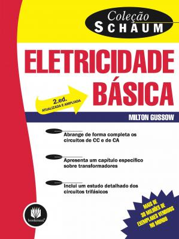

| Sistemas Embarcados > Conteúdo |
| --- |

# Eletricidade Básica

Prof. Eduardo Ono

 

## Conceitos

* Carga Elétrica

* Tensão Elétrica (Diferença de Potencial - DDP)

* Corrente Elétrica

* Potência Elétrica

 

## Vídeos de Apoio

| Thumb | Descrição |
| :-: | --- |
|  | [Manual do Mundo] [__Qual a diferença entre volt, watt e ampere? #ManualMaker Aula 2, Vídeo 1__](https://www.youtube.com/watch?v=JtttnL28m3Q)   (16:26, YouTube, Fev/2019)

 

## Bibliografia Básica

| Capa | Descrição |
| :-: | --- |
|  | [<a id="GUSSOW-2e_2009">GUSSOW-2e_2009</a>] GUSSOW, Milton; __Eletricidade Básica, 2. ed.__, Porto Alegre: Bookman, 2009.

 

## Bibliografia Complementar

| Capa | Descrição |
| :-: | --- |

 
