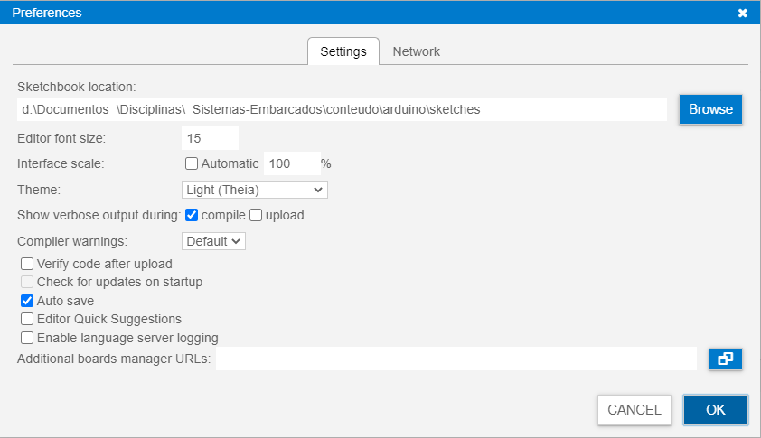

> #### Sistemas Embarcados > Conteúdo > Arduino

# Ambientes de Desenvolvimento

Prof. Eduardo Ono

 

## Arduino IDE + Placa Arduino

  

    <strong>Instalar e configurar o Arduino IDE</strong>
  

  <section markdown="1">

* Baixar o Arduino IDE no site https://www.arduino.cc/en/software

* OBS.: A versão estável (1.8.x) provavelmente será descontinuada em breve. Porém, a versão beta (2.0.x) consome ~800 MB de RAM, contra ~200 MB na versão estável.

* Instalar o Arduino IDE.

* Na janela Preferences do Arduino IDE (menu `File` -> `Preferences...`), especificar um diretório onde os projetos do Arduino serão armazenados (salvos).

  

* Criar um novo projeto no Arduino IDE (<kbd>Ctrl + N</kbd>). Uma nova instância (janela) do Arduino IDE será aberta, caso já exista algum projeto aberto.

* Conectar uma placa Arduino em uma porta USB do computador.

* Selecionar uma das seguintes placas: __Arduino Uno__, __Arduino MEGA__, __Arduino Leonardo__ ou __Arduino Nano__ através do menu `Tools` -> `Board` -> `Arduino AVR Boards`.

* Selecionar a porta do computador onde a placa foi concetada (por exemplo COM3) através no menu _Drop-Down_ na interface principal (na versão 2.0.x) ou através do menu `Tools` -> `Port` (na versão 1.8.x).

* Driver para chip CH340

  * https://www.arduined.eu/ch340-windows-10-driver-download/

  </section>

  

    <strong>Programar e compilar o projeto no Arduino IDE</strong>
  

  <section markdown="1">

* Criar um novo projeto no Arduino IDE (<kbd>Ctrl + N</kbd>). Uma nova instância (janela) do Arduino IDE será aberta, caso já exista algum projeto aberto.

* Selecionar uma das seguintes placas: Arduino Uno, Arduino Leonardo ou Arduino MEGA através do menu `Tools` -> `Board` -> `Arduino AVR Boards`.

* Incluir alguma biblioteca, caso necessário, através do `Library Manager`, na barra lateral esquerda (versão 2.0.x) ou através do menu `Sketch` -> `Include Library` -> `Manage Libraries`.

* Salvar (<kbd>Ctrl + S</kbd>) o projeto no diretório especificado na jalela `Preferences`. O nome do projeto é o nome do diretório que será criado no diretrório especificado. Por exemplo, caso o nome do projeto seja `Projeto`, será criado um diretório `Projeto`, com o arquivo (_sketch_) `Projeto.ino` dentro deste diretório.

* Compilar o projeto através do botão `Verify` ou <kbd>Ctrl + R</kbd>.

  </section>

  

    <strong>Carregar o programa no Arduino</strong>
  

  <section markdown="1">

* Após a compilação, clicar no botão `Upload` ou usar o atalho <kbd>Ctrl + U</kbd>.

  </section>

 

## Arduino IDE + SimulIDE (Simulador)

* [x] <strong>Instalar e configurar o Arduino IDE.</strong>

  

    <strong>Instalar modelos de placas no Arduino IDE</strong>
  

  <section markdown="1">

* Caso esteja utilizando o Arduino IDE

* Na barra lateral esquerda (Arduino IDE 2.0.x), clicar no botão `Boards Manager` e instalar a versão mais recente do _Arduino AVR Boards_ (by Arduino). Na versão 1.8.x, os modelos de placas Arduino já estão disponíveis para uso.

  </section>

* [x] <strong>Programar e compilar o projeto no Arduino IDE</strong>

  

    <strong>Instalar e configurar o SimulIDE</strong>
  

  <section markdown="1">

* Baixar o SimulIDE no site https://www.simulide.com/p/downloads.html

* Instalar o SimulIDE.

  </section>

  

    <strong>Exportar e carregar o binário no Arduino do SimulIDE</strong>
  

  <section markdown="1">

 * Após compilar o projeto no Arduino IDE, exportar o binário compilado através do menu `Sketch` -> `Export compiled Binary` ou pelo atalho <kbd>Ctrl + Alt + S</kbd>. Será criado um diretório `build` no diretório do projeto com o arquivo `.hex` em algum diretório mais interno.

* No SimulIDE, após adicionar o Arduino no circuito e "montar" o restante do circuito, conforme a programação, clicar com o botão direito do mouse sobre o Arduino e selecionar a opção `Carregar firmware`. Localizar e selecionar o arquivo `.hex` exportado conforme a etapa anterior.

  </section>

 

## Tinkercad (Simulador)

* // TODO

 
