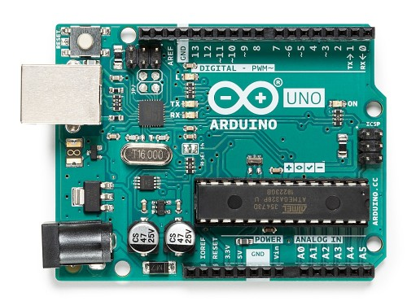

### Sistemas Embarcados

# Arduino

Prof. Eduardo Ono

 

## Overview

##### Fonte: https://store.arduino.cc/usa/arduino-uno-rev3

- [Brincando com Ideias] [Qual Arduino Comprar?](https://www.youtube.com/watch?v=FbYd9KPkkl4) (YouTube, 16:10, Abr/2019)

 

## Conceitos

 

## Fundamentos

- [Manual do Mundo] [Conheça os sensores do Arduino #ManualMaker Aula 6, Vídeo 1](https://www.youtube.com/watch?v=vEdYjAbzrAE) (YouTube, )

 

## Vídeos Recomendados

* [DroneBot Workshop] [RGB LEDs with Arduino - Standard & NeoPixel](https://www.youtube.com/watch?v=JpEFAXenTyY) (YouTube, 43:34, Abr/2018)
* [DroneBot Workshop] [Using LCD Displays with Arduino](https://www.youtube.com/watch?v=wEbGhYjn4QI) (YouTube, 46:22, Mar/2018)
* [How To Mechatronics] [How I2C Communication Works and How To Use It with Arduino](https://www.youtube.com/watch?v=6IAkYpmA1DQ) (YouTube, 9:57, Out/2015)

 

## Bibliografia

*
