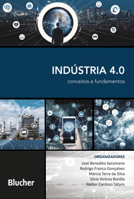

> <strong>Sistemas Embarcados > Conteúdo</strong>

# IoT (Internet das Coisas)

Prof. Eduardo Ono

 

## Tópicos

* ### [Overview](./00-overview)

* ### [Fundamentos](./fundamentos)

 

## Bibliografia Básica

 

## Bibliografia Complementar

 

| Capa | Descrição |
| :-: | --- |
| | [SACOMANO_2018]   SACOMANO, José Benedito et al.; __Indústria 4.0: Conceitos e Fundamentos__, São Paulo: Blucher, 2018.   https://www.bvirtual.com.br/NossoAcervo/Publicacao/164117

 
