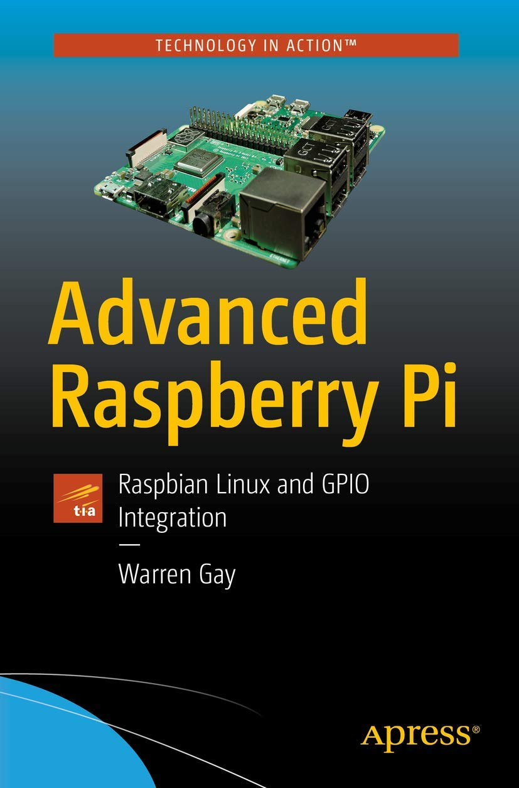

> #### Sistemas Embarcados

# Referências Bibliográficas

Prof. Eduardo Ono

 

|| Título |
| :-: | --- |
|  | <a id="GAY-2e_2018">[GAY_2018]</a>   GAY, Warren; __Advanced Raspberry Pi - Raspbian Linux and GPIO Integration, 2. ed.__, Apress, 2018.

 
